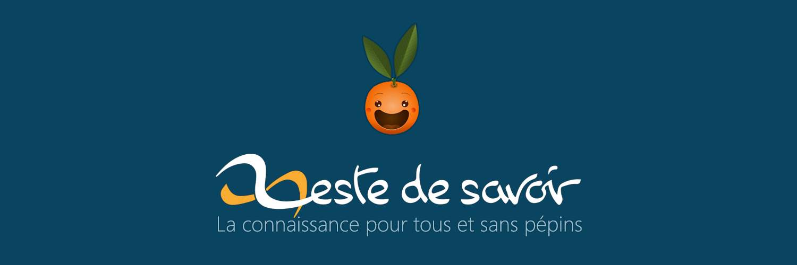

zestedesavoir.com est un site internet permettant le partage gratuit des connaissances, de préférence sous licence libre. Nous mettons à disposition une plateforme permettant de publier, et éditer des ressources pédagogiques (articles, tutoriels, …) sur différents sujets. Le site comporte également un forum permettant à la communauté de discuter et s’entraider.
Actuellement, la plupart des articles et tutoriels concernent l’informatique et les sciences, mais nous ne fermons aucunement la porte à d’autres sujets.
Le site est géré par une association loi 1901, “Zeste de Savoir”.

# En savoir plus sur le projet

## Genèse

Suite à la disparition du Site du Zéro, quelques anciens membres actifs (une trentaine) ont émis l’idée de recréer un site d’entraide et d’apprentissage libre et gratuit.
Ainsi est née l’idée de Zeste de Savoir (ZdS).

Après de nombreuses discussions, tant philosophiques que techniques, un certain nombre de décisions fondatrices ont été prises.

### Côté philosophie

- Création d’une association loi 1901 pour gérer le site, garantissant l’absence de publicités et de fonctionnalités payantes. Le site (et les éventuelles autres ressources de l’association) est gratuit et doit le rester.
- [Code open-source](https://github.com/zestedesavoir/zds-site), dès l’ouverture publique du site (et finalement, un peu avant). Le but est de permettre à chacun d’apporter sa pierre à l’édifice. Toute contribution, proposition, correction est bienvenue. Le code est sous licence GPL v3, et provient à la base d’un fork de [Progdupeupl](http://progdupeu.pl/).
- Ouverture à toute thématique, pourvu que l’article ou le tutoriel proposé soit pédagogique. Le partage des ressources sous licence libre est encouragé (mais pas obligatoire).

### Côté technique

- Le site utilise le framework Django (v1.6, Python 2.7).
- La base de données est gérée avec MySQL (PostgreSQL à l’origine, mais nos tests ont montré que MySQL était plus avantageux au final).
- Le serveur tourne sous nginx.

### Côté workflow et outils pour l’édition des tutos et les forums

- La rédaction se fait en markdown (tutoriels, articles et forums).
- Les articles et tutoriels sont versionnés grâce à l’utilisation de git.
- Avant publication, tout tutoriel est validé par une équipe de bénévoles, experts dans leurs domaines respectifs (à la manière du Site du Zéro pour ceux qui l'ont connu).
- Un système de validation, à la manière de feu “Le Site du Zéro” est mis en place pour garantir la qualité des cours proposé.

## Généralités et avancement

Le site est dès à présent fonctionnel.

Deux phases de bêta privée ont eu lieu en mai et juin, et une bêta publique a été ouverte pendant la deuxième quinzaine de juin.

Toutes les fonctionnalités principales sont disponibles. Aussi bien la rédaction et la publication des articles et tutoriels que le forum.

## Objectifs

Nous voulons permettre le partage des connaissances, librement et gratuitement. La notion de partage est au centre des préoccupations de Zeste de Savoir. C’est cette notion qui a conduit à la création d’une association loi 1901 et à l’ouverture du code.

Les forums ont été pensés au maximum pour l’entraide et la rédaction en markdown nous permet de proposer les cours sous différents formats (en ligne, en PDF ou encore en epub) facilement, afin de contenter le plus de personnes possible.

# Le projet et son originalité

Ce projet se distingue d'abord par la présence d'une association à but non lucratif comme structure légale du site. Cette structure pérennise le projet et prévient des potentielles dérives (publicité excessive, accès payant à certains contenus, etc.). Les seuls revenus de l'association à l'heure actuelle sont les cotisations de ses adhérents. Le montant de cette cotisation a été établi en fonction du nombre d'adhérents initial et afin de répondre aux dépenses nécessaires sur les deux premières années (hébergement, déclaration de l'association, etc.).

Le code étant open-source, les utilisateurs sont informés de toutes les évolutions et peuvent à tout moment prendre part au projet. Une fonctionnalité manque ? Proposez-la ! Et si vous n'avez pas les compétences nécessaires, parlez-en sur les forums : si votre fonctionnalité plaît, vous trouverez sûrement des développeurs motivés.

Enfin, ce projet reprend une recette qui a bien fonctionné par le passé (et il ne s'en cache pas !) : des tutoriels rédigés par la communauté et des forums pour les accompagner, tout cela dans une ambiance que beaucoup aimaient !

Les principaux atouts de Zeste de Savoir ont déjà été évoqués, à savoir :

- un site géré par une association loi 1901, garantissant la gratuité des ressources
- le code open-source, permettant à tout le monde de participer au développement et à l’amélioration du site

En espérant vous retrouver bientôt pour partager un p’tit zeste de savoir !

www.zestedesavoir.com
